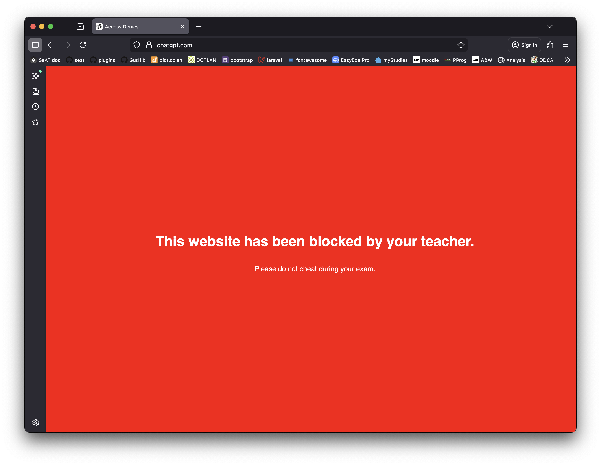
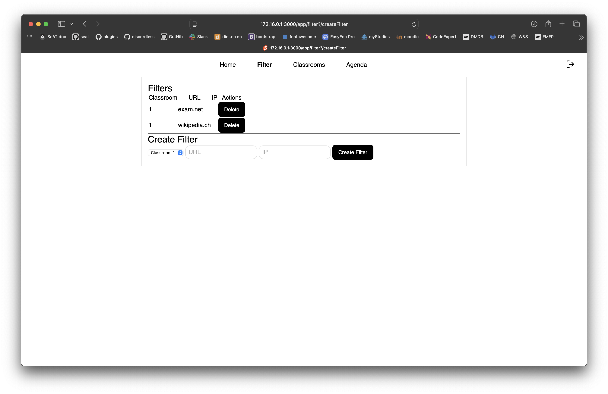
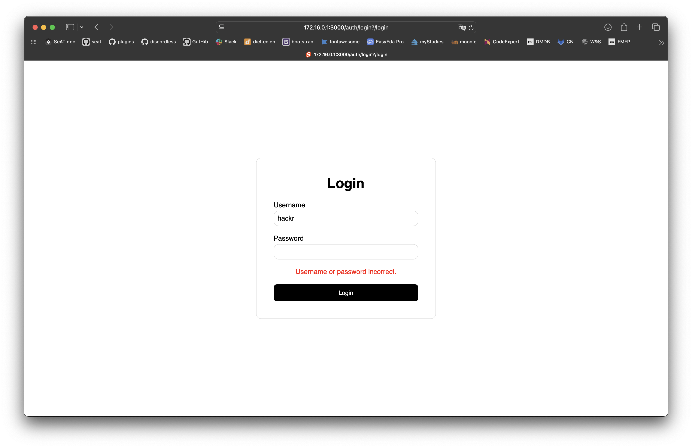

# NetSwitch

NetSwitch is a lightweight yet powerful MITM proxy that allows teachers to precisely control students’ internet access during lessons and exams. Using server‑side whitelists, only the websites that are actually needed are made available. This creates a calm, focused working environment without distractions. NetSwitch is flexible and can be used both in everyday classroom situations and during tests.

## Table of Contents
- [Features](#features)
- [Demo](#demo)
- [Architecture](#architecture)
- [Setup guide](#setup-guide)
- [Usage guide](#usage-guide)
- [Configuration](#configuration)
- [Accessing the dashboard](#accessing-the-dashboard)
- [Testing](#testing)
- [How it works](#how-it-works)
- [Some images](#some-images)

## Features
- Server‑side whitelist of Websites & IPs
- Real‑time filtering using mitmproxy
- Classroom‑based traffic separation
- Web interface for teachers (SvelteKit)
- Blocking of all non‑whitelisted IP traffic (HTTP, VPNs, Games)

## Demo
<video width="320" height="240" controls>
  <source src="./demo.mp4" type="video/mp4">
</video>
[video link](demo.mp4)

## Architecture
- **Proxy: [mitmproxy](https://www.mitmproxy.org/) with our custom addon.**
  Custom addon intercepts HTTP/HTTPS and filters based on database entries.
- **MySQL database**
  Stores classrooms, filters and user data.
- **CoreDns**
  Handles DNS routing inside the school network.
- **SvelteKit**
  Our frontend. Allows teachers to manage whitelist entries.
- **Node.js**
  To glue SvelteKit to the database.

## Setup guide
Installation is done with docker.

1. Get a copy of the source code
2. Copy `.env.example` to `.env`: `cp .env.example .env`
3. Open `.env` and configure your settings. They are described below
3. In the root directory of the project, run `make` to start all containers
4. After starting the project, a TLS CA certificate for the traffic inspection by the proxy is generated in the 
   `.mitmproxy` directory. This certificate must be installed on all client for HTTPS traffic inspection.

## Configuration
`Settings for .env, examples in .env.example`
- **DB_PASSWORD**
  Password for database.
- **DB_USER**
  User for database.
- **CLASSROOM_ID1**, **CLASSROOM_ID2**
  Which classroom filters the proxy uses.
- **PROXY_PORT**
  Change port of our proxy.

## Accessing the dashboard
1. Connect to the server's ip on port 3000
2. Log in to access the dashboard (unfortunately, the process to creaate credeintals for new installation isn't quite 
   ready)

## Testing
**mitmproxy test:**
1. start the project to get the DB going
2. Install requirements in `server/mitmproxy-container`
3. Add `google.com` to whitelist
4. Run `pytest -q ProxyTest.py` inside `server/mitmproxy-container/test`

**backend tests (very limited)**
1. start the project to get the DB and backend going
2. `cd server/server-backend`
3. `make`

## How it works

- Every classroom has a server through which the clients (Laptops) are routing all traffic.
- This is done using HTTP proxies. We only allow traffic to the HTTP proxy and DNS, all other traffic is rejected.
- The proxy inspects HTTP(S) traffic and checks if the URL or IPs is whitelisted. If traffic isn't whitelisted, it 
  is rejected by default.
- Using the WebUI teachers can whitelist URLs and IPs.

## Some Images

### Known issues
- CORS is largely disabled. We ran out of time to improve the setup in a way that allows us to run with CORS. This 
  should be done before production use.
- The dashboard performs almost no input validation, or if it does, you don't get useful error messages.
- The dashboard has a bunch of usability issues.
- Our architecture uses two backend servers for the frontend: A Sveltekit server and a node server. They could be 
  merged.
