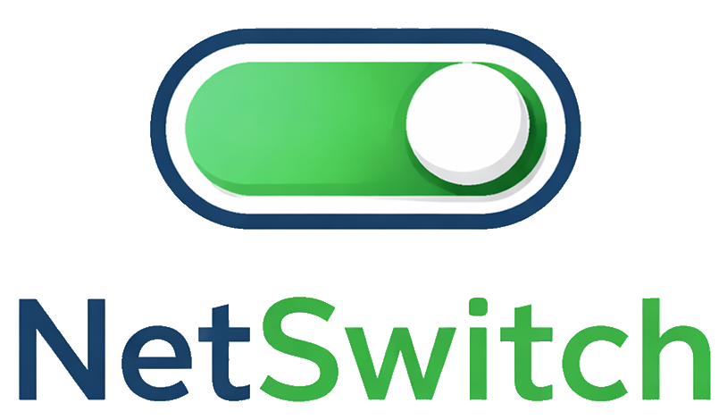
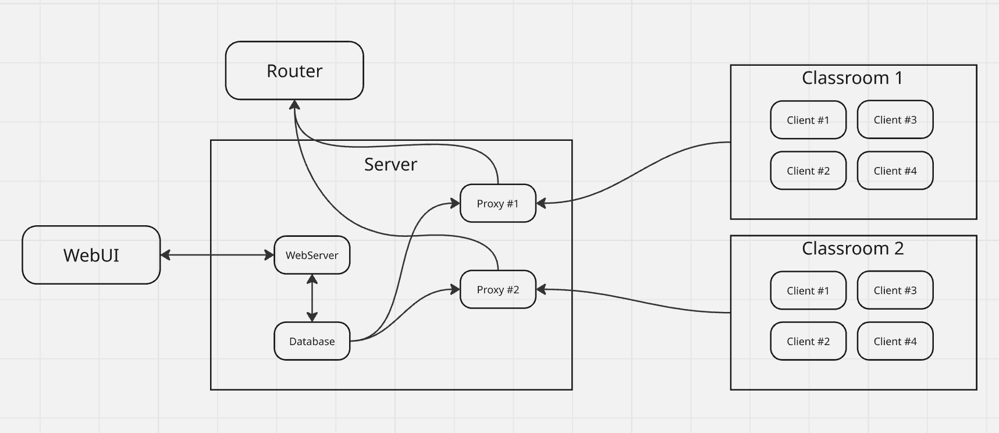

# NetSwitch

NetSwitch ist ein leichter, leistungsfähiger MITM‑Proxy, mit dem Lehrkräfte den Internetzugang ihrer Schüler während Unterricht und Prüfungen gezielt steuern können. Über serverseitige Whitelists lassen sich nur die Webseiten freigeben, die wirklich benötigt werden. So entsteht eine ruhige, konzentrierte Arbeitsumgebung ohne Ablenkungen. Flexibel einsetzbar im normalen Unterricht wie auch bei Klausuren.

## Features

## Architecture

## Setup guide

## Configuration
### Docker compose
- **MYSQL Database**
	- MYSQL_ROOT_PASSWORD
	- MYSQL_DATABASE
	- MYSQL_USER
	- MYSQL_PASSWORD
	- port

## Testing
**mitmproxy test:**
1. Install requirements in **server/mitmproxy-container**
2. Setup a test database (local or deploy our container)
3. Add **google.com** to whitelist
4. Run **ProxyTest.py** using: **pytest -q ProxyTest.py** in **server/mitmproxy-container/test**

## How it works

- Every classroom has a proxy on the server through which the clients (Laptops) are routing all traffic.
- The proxy forwards whitelisted URLs or IPs to the router, which are fetched from the Database. All other traffic is blocked.
- Using the WebUI teachers can whitelist URLs and IPs in the database.
- The router wont allow any traffic except when it is coming form one of the proxies.

